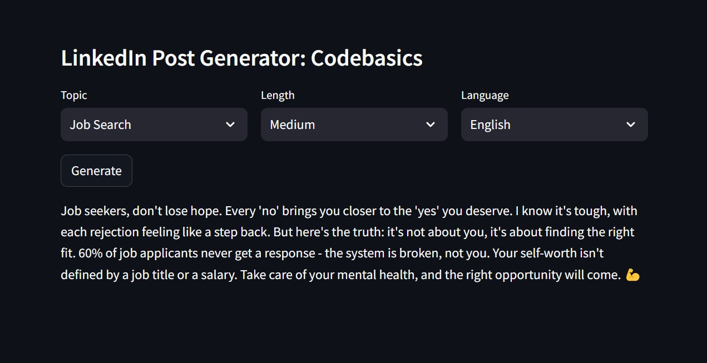

# project-genai-post-generator
This tool will analyze posts of a LinkedIn influencer and help them create the new posts based on the writing style in their old posts  



## Set-up
1. To get started we first need to get an API_KEY from here: https://console.groq.com/keys. Inside `.env` update the value of `GROQ_API_KEY` with the API_KEY you created. 
2. To get started, first install the dependencies using:
    ```commandline
     pip install -r requirements.txt
    ```
3. Run the streamlit app:
   ```commandline
   streamlit run main.py
   ```
Copyright (C) Codebasics Inc. All rights reserved.


**Additional Terms:**
This software is licensed under the MIT License. However, commercial use of this software is strictly prohibited without prior written permission from the author. Attribution must be given in all copies or substantial portions of the software.
